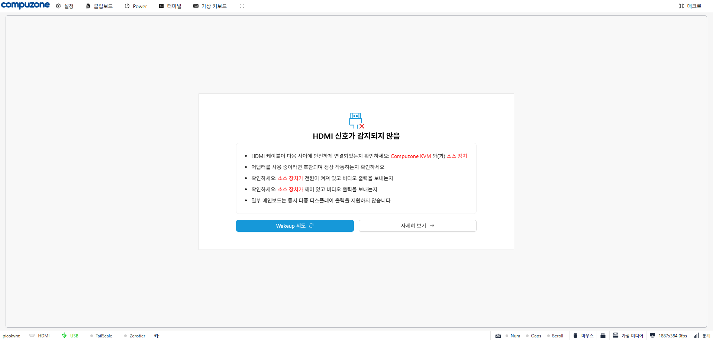

# Compuzone KVM

> 컴퓨존 브랜딩과 한글 UI를 적용한 IP KVM 펌웨어.
> [Luckfox PicoKVM](https://wiki.luckfox.com/Luckfox-PicoKVM/) (Rockchip RV1106 기반) 하드웨어용으로 빌드되며, [luckfox-eng29/kvm](https://github.com/luckfox-eng29/kvm) 의 포크이고 그 자체는 [JetKVM](https://jetkvm.com/) 의 2차 개발물입니다.

---

## 개요

이 저장소는 LuckFox PicoKVM 디바이스의 펌웨어/소프트웨어를 컴퓨존(Compuzone) 환경에 맞게 재브랜딩한 버전입니다. 원본 LuckFox PicoKVM 의 모든 기능을 그대로 유지하면서 다음을 추가/변경했습니다.

### 주요 변경 사항

- **컴퓨존 브랜딩**
  - 웹 UI 로고 → Compuzone 로고
  - LCD 메인 화면 로고 → Compuzone 로고
  - 부팅 스플래시 → Compuzone 이미지
- **한국어 지원**
  - 웹 UI 한국어 로케일 (`ui/src/locales/ko.json`)
  - LCD UI 라벨 한글화 (CPU 사용량, RAM 사용량, CPU 온도, IP 주소, MAC 주소, 호스트 이름, 앱 버전, 연결 끊김/연결됨/로그인됨)
  - LCD 날짜 표시 한국어 요일 (월/화/수…)
- **시스템 로컬라이제이션**
  - 호스트 이름: `compuzone-kvm`
  - 시간대: `KST-9` (Asia/Seoul)
- **자체 OTA 업데이트 채널**
  - `HoMongYi/compuzone-kvm` GitHub 릴리스에서 직접 펌웨어 업데이트
  - GitHub Actions 로 자동 빌드/릴리스
  - 시스템(rootfs) 업데이트는 명시적 `.zip` 자산이 있을 때만 동작 (실수로 인한 brick 방지)
- **LCD UI용 한글 폰트**
  - LVGL 폰트(`montserratMedium_14/16/18/32`)를 NanumSquareRoundB 기반으로 재생성, Font Awesome 심볼 포함

---

## 스크린샷

### 웹 UI (컴퓨존 브랜딩)



상단에 컴퓨존 로고, 한글 메뉴 (설정 · 키보드 · Power · 터미널 · 가상 키보드 · 매크로), 하단 상태바 한글화.

### OTA 업데이트 다이얼로그


`HoMongYi/compuzone-kvm` 릴리스에서 새 버전을 확인하고 한 번의 클릭으로 설치.

---

## 하드웨어

| 항목 | 사양 |
|---|---|
| SoC | Rockchip RV1106 (ARM Cortex-A7, 1.2GHz) |
| 메모리 | 256MB DDR3L |
| 디스플레이 | 1.54인치 IPS (240x240) |
| 영상 입력 | HDMI 1080p@60 캡처 |
| USB | HID(키보드/마우스), MSD, 가상 시리얼 |
| 네트워크 | 100Mbps 이더넷 |
| 부팅 | eMMC + microSD |

자세한 정보: [Luckfox PicoKVM Wiki](https://wiki.luckfox.com/Luckfox-PicoKVM/)

---

## 디렉터리 구조

```
compuzone-kvm/
├─ .github/workflows/release.yml   # 자동 릴리스 (태그 push 시 빌드)
├─ cmd/                            # Go 진입점 (kvm_app 메인)
├─ internal/                       # 내부 패키지 (USB gadget, 네트워크 등)
├─ ui/                             # React + TypeScript 프론트엔드
│  └─ src/locales/{en,ko,zh}.json  # 다국어 번역
├─ resource/jetkvm_native          # LCD UI 바이너리 (kvm_display)
├─ scripts/
│  ├─ build_native.sh              # kvm_display 빌드 (WSL/Linux)
│  ├─ build_korean_font.sh         # LVGL 한글 폰트 생성
│  ├─ build_bootlogo.sh            # 부팅 스플래시 raw 이미지
│  └─ deploy.ps1                   # 디바이스 배포 (PowerShell)
├─ docs/                           # 가이드 문서
├─ ota.go                          # OTA 클라이언트
├─ vpn.go, native_*.go             # VPN, LCD/오디오 IPC
└─ Makefile, go.mod
```

---

## 빌드

### 사전 준비

- **Windows**: PowerShell 7+, OpenSSH Client, [WSL2 + Ubuntu](https://learn.microsoft.com/windows/wsl/install)
- **Go**: 1.23 이상
- **Node.js**: 20 이상
- **WSL 안에 필요한 도구**: `build-essential`, `wget`, `zstd`, `python3`, `npm` (스크립트가 자동 설치)

### 1) `kvm_app` (백엔드 + 프론트엔드 + 웹 UI)

```powershell
# 전체 빌드 + 디바이스 배포
.\scripts\deploy.ps1 -DeviceIp <KVM_IP>
```

내부 동작:

1. `ui/` → `npm run build:device` (정적 파일 → `static/`)
2. Go cross-compile (ARMv7 Linux): `bin/kvm_app`
3. SCP 로 `<KVM_IP>:/userdata/picokvm/bin/kvm_app` 업로드
4. 디바이스에서 프로세스 재시작

### 2) `kvm_display` (LCD UI, 한글 폰트, Compuzone 로고)

WSL 안에서 실행 (Rockchip 툴체인 다운로드 + LVGL 폰트 재생성 + 빌드):

```powershell
wsl bash /mnt/d/Projects/compuzone-kvm/scripts/build_native.sh /mnt/d/Projects/compuzone-kvm/compuzone.jpg
```

결과: `resource/jetkvm_native` (1.5MB 내외)

배포:

```powershell
# kvm_app 과 함께 LCD 바이너리도 업로드
.\scripts\deploy.ps1 -DeviceIp <KVM_IP> -DeployDisplay
```

> ⚠️ OEM 펌웨어가 부팅 시 `/etc/init.d/S20updatedata` 로 `/usr/bin/kvm_display` 를 복원하므로, 영구 적용하려면 마스터 경로도 함께 덮어써야 합니다 (스크립트가 출력하는 안내 참고).

### 3) 부팅 스플래시 이미지 (선택)

```powershell
wsl bash /mnt/d/Projects/compuzone-kvm/scripts/build_bootlogo.sh /mnt/d/Projects/compuzone-kvm/compuzone.jpg
```

→ `resource/bootlogo.raw` 생성. `S15bootlogo` init 스크립트와 함께 디바이스에 복사.

---

## 디바이스 배포

```powershell
# 처음 배포 또는 코드 변경 후
.\scripts\deploy.ps1 -DeviceIp 192.168.0.100

# 프론트엔드만 변경되었을 때 (Go 빌드 스킵)
.\scripts\deploy.ps1 -DeviceIp 192.168.0.100 -SkipBuild

# LCD UI 도 함께 배포
.\scripts\deploy.ps1 -DeviceIp 192.168.0.100 -DeployDisplay
```

기본값: SSH 사용자 `root`, 디바이스 비밀번호는 OEM 기본값 (디바이스 라벨 참조).

---

## OTA 업데이트

이 빌드는 GitHub `HoMongYi/compuzone-kvm` 의 최신 릴리스를 자동으로 확인합니다.

### 사용자 입장

웹 UI → **설정 → 버전 → 업데이트 확인** → 새 버전이 있으면 안내 → "지금 업데이트" 클릭

### 새 버전 릴리스하기 (관리자 입장)

1. 코드 변경 후 `Makefile` 의 `VERSION` bump (예: `0.1.2` → `0.1.3`)
2. 커밋/푸시
3. 태그 생성 후 push:
   ```bash
   git tag v0.1.3
   git push origin v0.1.3
   ```
4. GitHub Actions(`.github/workflows/release.yml`) 가 자동으로:
   - 프론트엔드 + Go 백엔드 빌드
   - `bin/kvm_app` + SHA256 생성
   - GitHub Release 생성 + 자산 업로드
5. 디바이스에서 OTA 확인 시 새 버전이 노출됨

### 안전장치

- 시스템 zip(`*.zip`) 자산이 릴리스에 없으면 시스템 업데이트는 시도되지 않습니다 (`SystemUpdateAvailable=false`)
- GitHub 자동 생성 `zipball_url` (소스코드 zip) 은 시스템 이미지로 인식되지 않도록 차단
- `kvm_display` (LCD UI), 부트 스플래시, 한글 폰트, hostname/TZ 는 OTA 영향을 받지 않음 (별도 관리)

---

## 라이선스

원본 LuckFox PicoKVM 과 동일하게 **GNU General Public License v2.0** ([LICENSE](./LICENSE))

본 프로젝트는 다음 오픈소스 프로젝트를 기반으로 합니다:

- [JetKVM](https://github.com/jetkvm/kvm) — 원본 IP KVM 소프트웨어
- [luckfox-eng29/kvm](https://github.com/luckfox-eng29/kvm) — LuckFox PicoKVM 포크 (백엔드/UI)
- [luckfox-eng29/kvm_display](https://github.com/luckfox-eng29/kvm_display) — LCD UI 데몬
- [LVGL](https://lvgl.io/) — 임베디드 그래픽 라이브러리
- [NanumSquareRound](https://hangeul.naver.com/font) — 한글 폰트 (네이버, OFL)
- [Font Awesome](https://fontawesome.com/) — 아이콘 폰트

---

## 트러블슈팅 / 문서

- 배포: [`.windsurf/workflows/deploy.md`](./.windsurf/workflows/deploy.md)
- LCD UI 재빌드: [`.windsurf/workflows/build-native.md`](./.windsurf/workflows/build-native.md)
- LCD 리브랜딩 메모: [`docs/LCD_UI_REBRANDING.md`](./docs/LCD_UI_REBRANDING.md)
